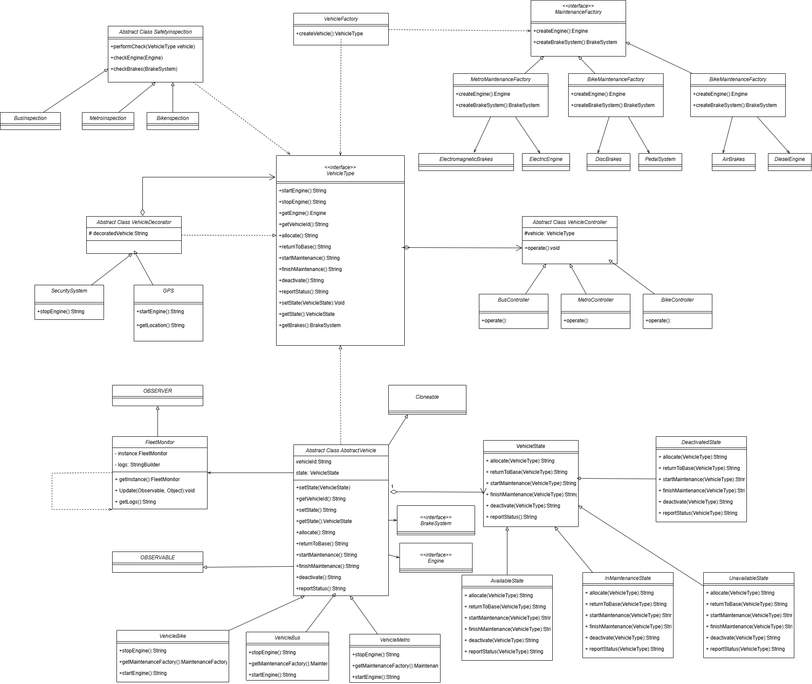

# Controle de Frotas

Esta aplicação foi desenvolvida como trabalho final da disciplina de engenharia de software e tem como proposito gerenciar a frota de veículos. Seu objetivo é facilitar o controle, monitoramento e manutenção dos veículos (como ônibus, bicicletas e metrôs) através de uma arquitetura robusta que utiliza diversos padrões de design, garantindo modularidade, flexibilidade e facilidade de manutenção.

A aplicação integra as seguintes funcionalidades:
- **Controle de Estado:** Gerenciamento dos estados dos veículos (disponível, alocado, em manutenção, desativado) com comportamento específico para cada situação.
- **Monitoramento Automático:** Utilização do padrão Observer para notificar o sistema de monitoramento sempre que há alteração no estado dos veículos.
- **Criação de Veículos:** Uso dos padrões Factory Method e Abstract Factory para centralizar e especializar a criação dos veículos e seus componentes (motores e freios).
- **Inspeção de Segurança:** Implementação do Template Method para definir um fluxo fixo de inspeção, permitindo customizações em subclasses.
- **Extensão de Funcionalidades:** Adoção do padrão Decorator para adicionar recursos extras (como GPS e sistemas de segurança) aos veículos sem modificar sua estrutura original.
- **Separação de Abstração:** Aplicação do padrão Bridge, separando a lógica de controle do veículo dos detalhes de implementação, permitindo evolução independente.
- **Gerenciamento Global:** Uso do padrão Singleton para assegurar que o monitor de frota (`FleetMonitor`) exista como uma única instância no sistema.
- **Clonagem de Veículos:** Implementação do padrão Prototype para permitir a clonagem de veículos já configurados, facilitando a criação de novas instâncias com configurações semelhantes sem a necessidade de recriar toda a lógica de construção.

## Diagrama UML

## Resumo dos Padrões e Suas Finalidades

| **Padrão**         | **Finalidade**                                                                 |
|---------------------|-------------------------------------------------------------------------------|
| **State**           | Gerencia os estados dos veículos (ex: disponível, em manutenção) e define comportamentos específicos para cada estado. |
| **Observer**        | Notifica automaticamente o sistema de monitoramento (`FleetMonitor`) quando ocorrem mudanças no estado de um veículo. |
| **Factory Method**  | Centraliza e encapsula a criação de objetos veículo (ex: `VehicleBus`, `VehicleMetro`) em um único ponto. |
| **Abstract Factory**| Cria famílias de objetos relacionados (ex: motores e freios específicos) para diferentes tipos de veículos. |
| **Template Method** | Define um fluxo fixo para inspeções (etapas comuns), permitindo personalização em subclasses (ex: verificação de motor específico). |
| **Decorator**       | Adiciona funcionalidades extras a veículos (ex: GPS, segurança) de forma flexível, sem modificar sua estrutura original. |
| **Bridge**          | Separa a abstração (controle do veículo) da implementação (detalhes do veículo), permitindo que ambas variem independentemente. |
| **Singleton**       | Garante que exista apenas uma instância global do monitor de frota (`FleetMonitor`) em todo o sistema. |
| **Prototype**       | Permite a clonagem de veículos já configurados, facilitando a criação de novas instâncias com configurações semelhantes. |
